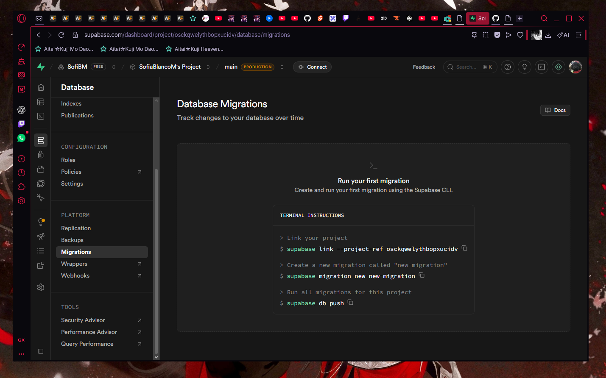
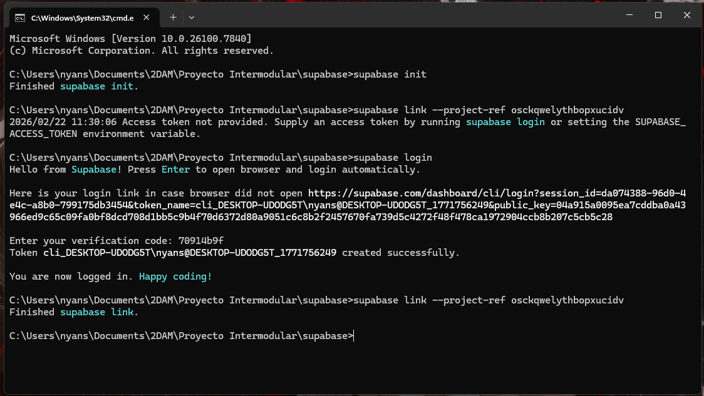
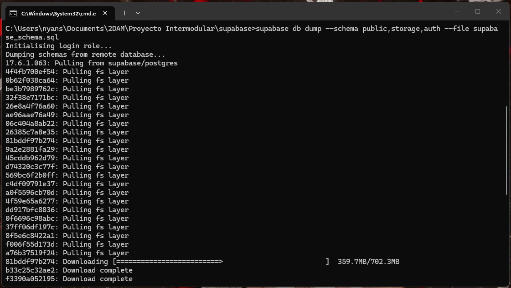
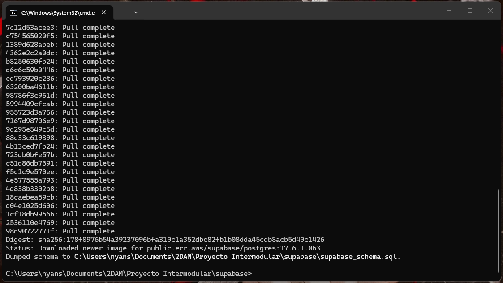
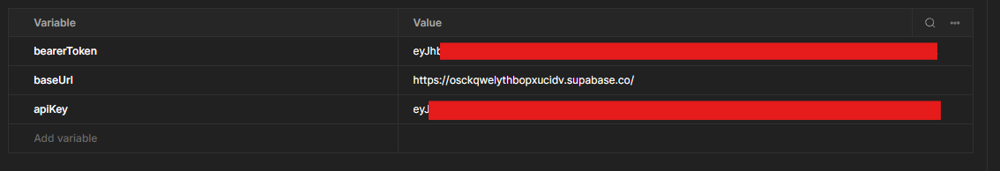

# Generar una migración desde Supabase
El objetivo es aprender a como generar una migración para obtener los siguientes puntos de nuestra infraestructura en Supabase:
- **Esquema de base de datos**
  - Triggers
  - Functions
  - Datos por defecto
  - Configuración como por ejemplo: RLS
- **Esquema de los *Storages***
  - Buckets donde se guardan las imagenes. En nuestro caso, solo tenemos uno para las imagen de portada de un libro

## Requisitos

- **Docker Desktop**
- **Supabase CLI**

## Instalación de Supabase CLI 

### Windows
Para instalar **Supabase CLI**, abre una terminal y ejecuta los siguientes comandos: 

```bash
    Set-ExecutionPolicy RemoteSigned -Scope CurrentUser
    Invoke-RestMethod -Uri httbash://get.scoop.sh/ | Invoke-Expression

    scoop bucket add supabase https://github.com/supabase/scoop-bucket.git

    scoop install supabase
```

## Migración de base de datos 
Una vez **instalado Supabase CLI**, el siguiente paso es conectarse con la instancia de  **Supabase que tenmos desplegado** en *cloud*.

Para ello, nos loguearmos en Supabase desde el navegador para ver el comando de link y poder loguearnos desde la terminal.

- En Supabase, abriremos la página ``Database > Migrations`` para obtener el comando: ``supabase link --project-ref asc...`` .

- 

- Una vez logueados desde el navegador, nos abriremos una terminal en la carpeta donde queramos que se guarde la migración y ejecutaremos el siguiente comando:
  
- ```bash
    supabase init
    supabase login
  ```
- Se debe abrir una pestaña en el navegador con el código de verificación a introducir en la terminal y después podremos ejecutar el siguiente comando:

- ```bash
  supabase link --project-ref refrencia-generada-por-supabase
  ```

- 

> **IMPORTANTE:** Desde este paso, debemos tener **Docker Desktop abierto**

Por último, generamos el script sql con el siguiente comando:

- ```bash
  supabase db dump --schema public,storage,auth --file 20260222123000_supabase_schema.sql
  ```

- 
- 

Podremos encontrar el fichero generado [aquí](../../src/main/java/es/cifpcarlos3/pimandragora/infrastructure/data/supabase/migrations/20260222123000_supabase_schema.sql) 

## Ejecutar la migración

- Para ejecutar la migracion generada, tenemos que crear la carpeta migrations dentro de la carpeta supabase donde hemos hecho el ``supabase init`` y meter el fichero sql con la migración ahí.
- En la terminal que tenemos abierta, ejecutamos el comando:
  - ```bash
     supabase db reset
      ```

## Siguientes pasos 

Este Script genera solo el *esqueleto* de nuestra infraestructura, ahora debemos rellenarla con datos. Para ello, necesitamos dos cosas:
- Generar datos de prueba con el script [default-seed-migration.sql](../../src/main/java/es/cifpcarlos3/pimandragora/infrastructure/data/supabase/migrations/default-seed-migration.sql). Esto podemos hacerlo copiando el sql desde la interfaz gráfica y ejecutándolo.

- Crear un usuario de prueba. Para hacer esto bien, tenemos que llamar a los endpoints que expone supabase. Aquí dejamos una [colección de postman](../../src/main/java/es/cifpcarlos3/pimandragora/infrastructure/data/supabase/migrations/mandragora.postman_collection.json) preparada en la que solo hay que configurar las variables de la colección:
  - API Key
  - Supabase URL
  - Bearer Token

Primero hay que ejecutar la request de ``Create User`` y con el id de usuario que devuelve, ponerlo en el body de la de ``Create Profile`` y listo, tendriamos el usuario:
- Email: **rne@alu.murciaeduca.es**
- Password: **123456**
 