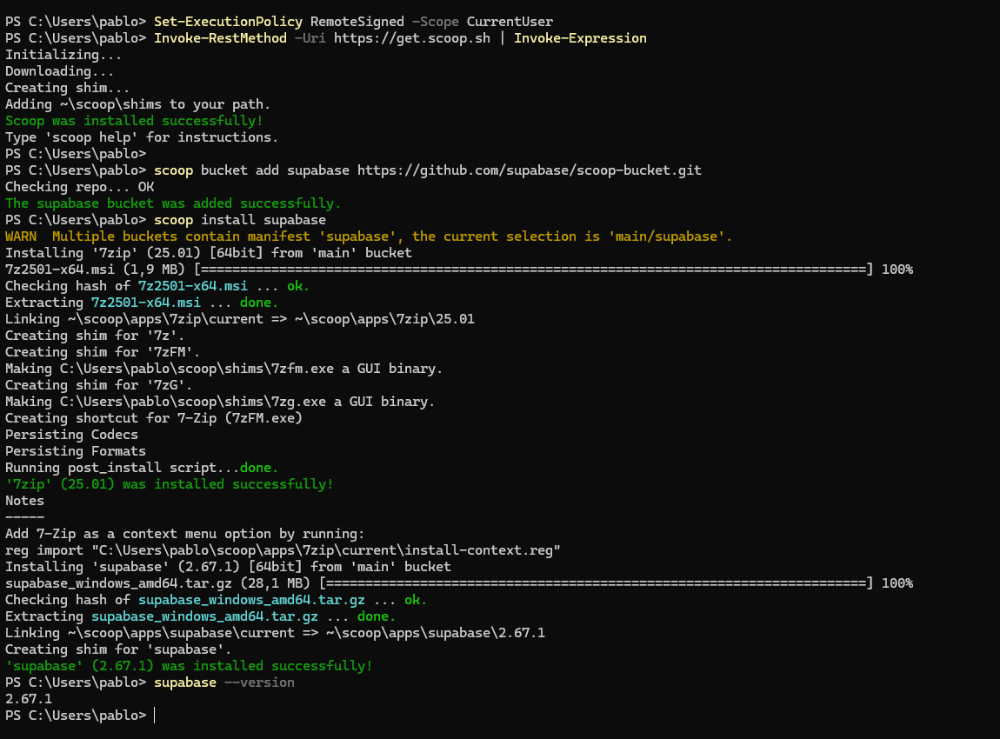
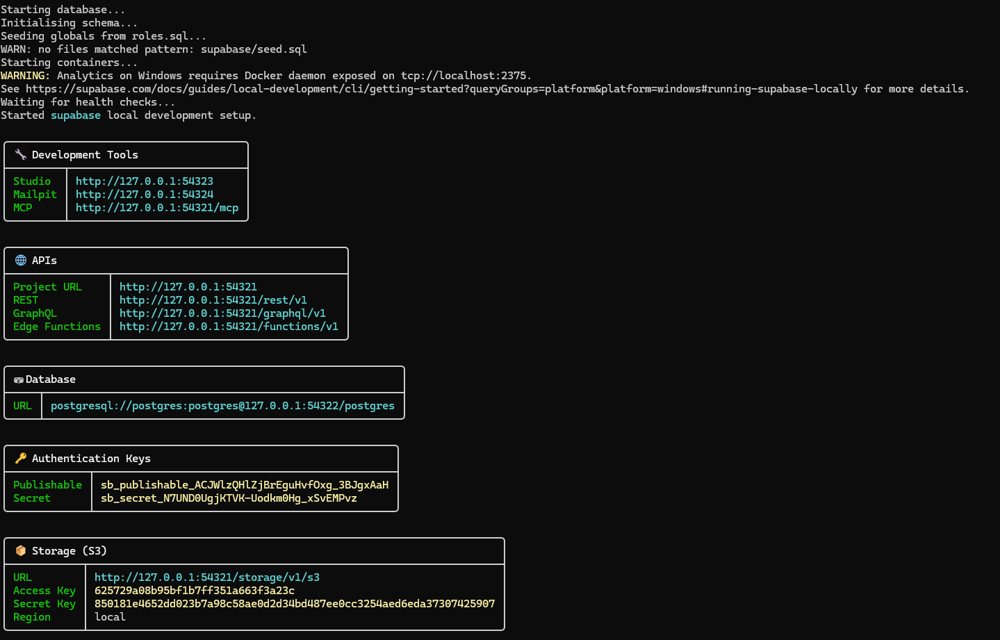
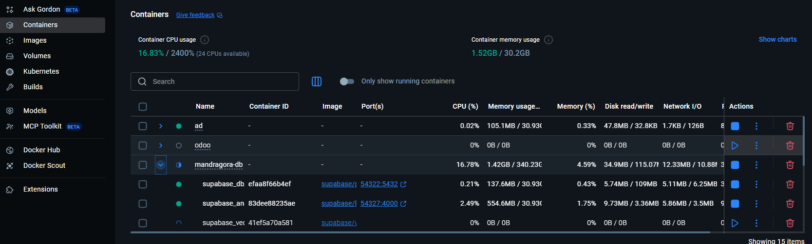

# Local Environment Setup

## Requisitos
- Docker desktop
- Supabase CLI

## Instalar Docker Desktop
TODO

## Instalar Supabase CLI
- Abir una terminal y ejecutar estos comandos :
```bash
Set-ExecutionPolicy RemoteSigned -Scope CurrentUser
Invoke-RestMethod -Uri https://get.scoop.sh | Invoke-Expression
```

```bash
scoop bucket add supabase https://github.com/supabase/scoop-bucket.git
scoop install supabase

```

La terminal tiene que quedar así:


## Pull Supabase DB 
Con la CLI instalada vamos a crear la carpeta donde irá nuestra base de datos en local.

Nos tenemos que ir a una carpeta fuera del repo, *no queremos commitear la base de datos en local*
 
Yo tengo el repo en: 
- `C:\...\2DAM\PI\Repos\pi-mandragora` 

y la base de datos en local en:
- `C:\...\2DAM\PI\mandragora-db`

Una vez elegida la carpeta donde vais a tener la DB, ejecutais estos comandos para descargar e inicializar Supabase:

```bash
supabase init
supabase start
```
Deberías ver algo como esto:
>! **IMPORTANTE**: **Esto son secretos**, no hay problema con *leakear* esta información porque son solo de **vuestro local**, pero de todas maneras **no podemos commitearlo** al repo, porque si **seria un problema de seguriadad** leakear los de el Supabase que habreis creado en la nube.

>! Como estos **secretos** serán **necesarios** para **conectarse a base de datos** desde la aplicación, tendremos un **archivo de configuración por entorno** donde se guardará todo, estos fichero de configuración no los *commitearemos *



Y en docker desktop:


Una vez esté corriendo Supabase, utilizaremos las claves que tenemos en la terminal para conectarnos desde Java FX

Con el comando `supabase status` podremos volver a sacar las keys desde la terminal.